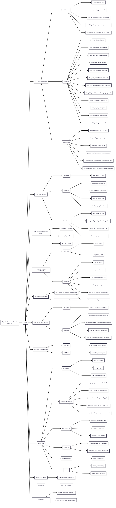

# Bayesian Inference of Coral Bleaching Dynamics

This project is available on GitHub at: [https://github.com/jodie-c/stan_tutorial/tree/main/coral-reef-example](https://github.com/jodie-c/stan_tutorial/tree/main/coral-reef-example)

## What's in this repo?
- **95 total files** 
- **11 main folders** 
- **14 R scripts** 
- **16 Stan models** 
- **27 RDS files** 

## Folder Structure

The repository is organized into 11 main directories:

**01. pooling_methods/**: This is where the main modeling happens!
   - **r_file/**: 4 R scripts for 4 different pooling approaches
   - **stan_file/**: The corresponding 6 Stan models I wrote
   - **rds/**: Saved model fits

**02. prior_check_r_stan_plot/**: Prior distribution analysis
   - **prior_check_r_file/**: R scripts for 4 different prior checks
   - **prior_check_stan_file/**: 4 Stan models with different prior specifications
   - **prior_check_rds/**: RDS files for prior check results

**03. posterier_predictive_check/**: Model validation
   - 3 R scripts for Bayesian p-values, posterior predictive checks

**04. leave_one_out_validation/**: Cross-validation analysis
   - **r file/**: 2 R scripts for LOO validation and plotting
   - **rds/**: RDS files with LOO comparison results

**05. mcmc_diagnostics/**: Making sure my MCMC chains converged properly
   - Checked for divergences and other sampling issues

**06. pooling_method_for_sparse_data/**: Sparse data analysis
   - **r_file/**: R script for partial pooling with sparse data
   - **rds/**: RDS files with sparse data model fits

**07. prediction_for_unseen_data/**: Out-of-sample prediction
   - **r_file/**: R script for predicting on new data
   - **rds/**: RDS files with prediction results

**08. plots/**: Visualization outputs
   - **01. prior_check/**: Prior distribution visualizations
   - **02. posterior_prediction_check/**: Model validation plots
   - **03. leave_one_out_validation/**: Cross-validation diagnostic plots
   - **04. prediction_for_unseen_data/**: Prediction accuracy visualizations
   - **05. coral_reef_dynamic/**: Coral reef dynamics visualizations
   - **06. funnel_reparameterization/**: Centered and non-centered reparameterization

**09. master_thesis/**: My master thesis document

**10. data/**: Raw and processed coral data

**11. funnel_reparameterization/**: R scripts for analyzing centered and non-centered parameterizations
   - Launch scripts for ShinyStanR to visualize MCMC diagnostics

## Models

The project implements several Bayesian modeling approaches:
- Complete pooling: Assumes all reefs share identical parameters
- No pooling: Treats each reef as completely independent
- Partial pooling: Hierarchical model that balances between complete and no pooling
  - Centered parameterization
  - Non-centered parameterization
  - Sparse data handling

## Requirements

- R (>= 4.0.0)
- RStan
- dplyr
- tidyr
- magrittr
- loo (for leave-one-out cross-validation)
- bayesplot (for MCMC diagnostics and visualization)

Each R script can be run on its own. My typical workflow was:

1. Clean up the messy coral data
2. Fit models with Stan (this takes a while ⏳)
3. Check if the MCMC sampling worked properly
4. See if the model predictions make sense
5. Compare different models
6. Make pretty plots of the results

Feel free to reach out if you have questions!

## Author

Chen Gu
